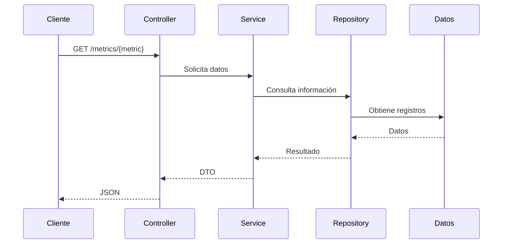
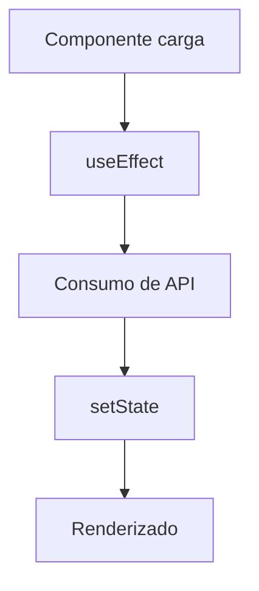
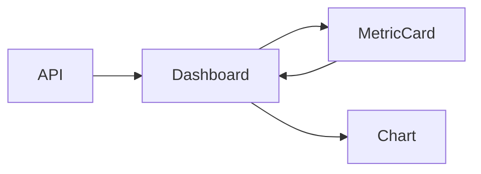

# M6 AdvancedWeb Actividad de Clase Análisis de Código 

Aplicación web para visualizar métricas de productividad de desarrolladores. El backend expone una API REST con Spring Boot y el frontend consume los datos para mostrarlos mediante gráficas con React y Chart.js.

---

# Cómo ejecutar el proyecto

## Backend

```bash
cd backend
./mvnw spring-boot:run
```

Servidor disponible en:

```text
http://localhost:8080
```

## Frontend

```bash
cd frontend/productivity-dashboard
cp .env.example .env
cd ..
npm install
npm run dev
```

Aplicación disponible en:

```text
http://localhost:5173
```

---

# Parte 1 — Análisis del Backend

## 1. Estructura general

```
backend/
├── pom.xml
└── src/
    ├── main/
    │   ├── java/com/exampleback/demo/
    │   │   ├── DemoApplication.java          
    │   │   ├── config/
    │   │   │   ├── CorsConfig.java           
    │   │   │   ├── MetricsProperties.java    
    │   │   │   └── SecurityConfig.java       
    │   │   ├── controller/
    │   │   │   └── MetricsController.java   
    │   │   ├── dto/
    │   │   │   └── MetricResponseDTO.java    
    │   │   ├── model/
    │   │   │   └── DeveloperMetric.java      
    │   │   ├── repository/
    │   │   │   └── DeveloperMetricRepository.java 
    │   │   └── service/
    │   │       └── MetricsService.java       
    │   └── resources/
    │       └── application.yml              
    └── test/
        └── java/com/exampleback/demo/
            └── DemoApplicationTests.java
```

### Capas principales

| Capa | Función |
|--------|---------|
| Controller | Recibe peticiones HTTP y devuelve respuestas |
| Service | Contiene la lógica de negocio |
| Repository | Acceso a los datos |
| DTO | Define la estructura de los datos enviados al cliente |
| Model | Representa las entidades del sistema |
| Config | Configuración de seguridad y CORS |

---

## 2. Flujo de una petición



---

## 3. Seguridad y CORS

### Seguridad

- API configurada como pública mediante `permitAll()`.
- CSRF deshabilitado por tratarse de una API stateless.

### CORS

- Permite solicitudes desde el frontend.
- Los orígenes permitidos se configuran desde `application.yml`.

---

## 4. Posibles mejoras

- Integrar PostgreSQL y Spring Data JPA.
- Agregar validaciones adicionales a los endpoints.
- Incorporar documentación con Swagger/OpenAPI.
- Añadir pruebas unitarias y de integración.
- Implementar filtros por fechas y desarrolladores.

---

# Parte 2 — Análisis del Frontend

## 1. Estructura de carpetas


```
frontend/
├── package.json                          
└── productivity-dashboard/
    ├── .env                              
    ├── index.html                        
    ├── vite.config.js                    
    ├── package.json                      
    └── src/
        ├── main.jsx                     
        ├── App.jsx                       
        ├── index.css                     
        ├── component/
        │   └── Dashboard.jsx             
        ├── services/
        │   └── metricsService.js         
        └── styles/
            └── Dashboard.module.css     
```

---

## 2. Componentes principales

| Componente | Función |
|------------|----------|
| App | Componente raíz |
| Dashboard | Manejo de estado, consumo de API y visualización |
| MetricCard | Selección de métricas |
| StatItem | Visualización de estadísticas |
| Chart.js | Representación gráfica de los datos |

---

## 3. Manejo del estado con Hooks

Se utilizan los siguientes hooks:

- `useState` para almacenar métricas, selección y estado de carga.
- `useEffect` para obtener los datos al cargar la aplicación.

### Flujo



---

## 4. Consumo de APIs

La comunicación con el backend se realiza mediante Axios.

```javascript
GET /metrics/{metric}
```

Las métricas disponibles son:

- commits
- bugs
- tasks
- storyPoints

Las peticiones se ejecutan en paralelo mediante `Promise.all()`.

---

## 5. Flujo de datos entre componentes



El componente Dashboard centraliza la información y distribuye los datos hacia los componentes de visualización.

---

## 6. Implementación de gráficas

La aplicación utiliza Chart.js para mostrar métricas mediante gráficas de línea.

Los datasets se generan dinámicamente con la información recibida desde la API y se actualizan según las métricas seleccionadas por el usuario.

---
