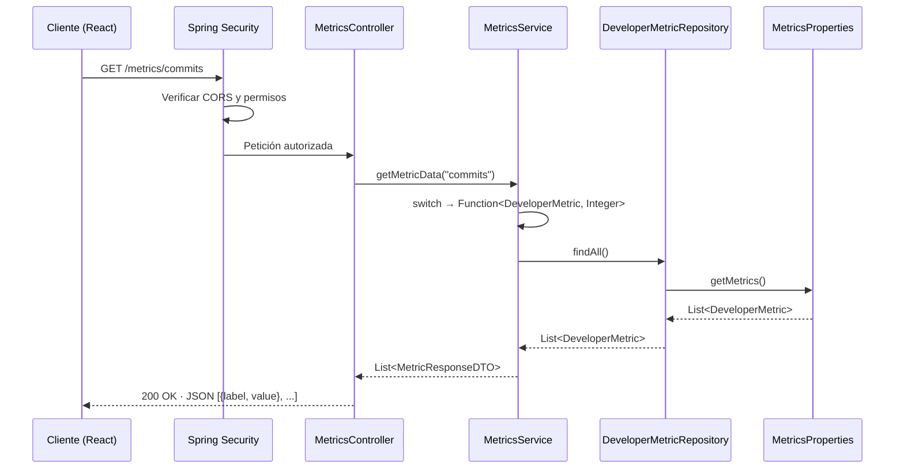
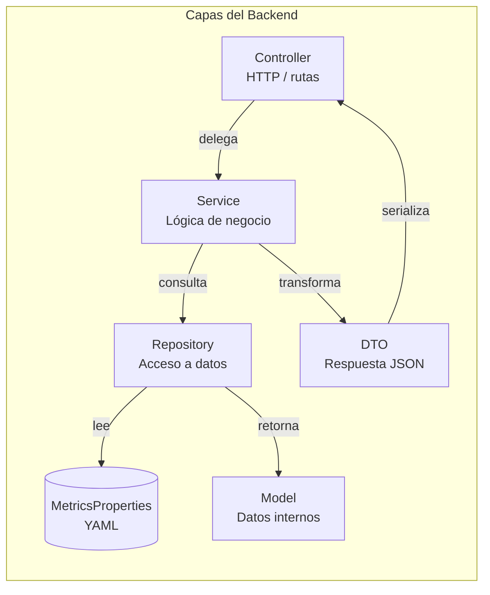
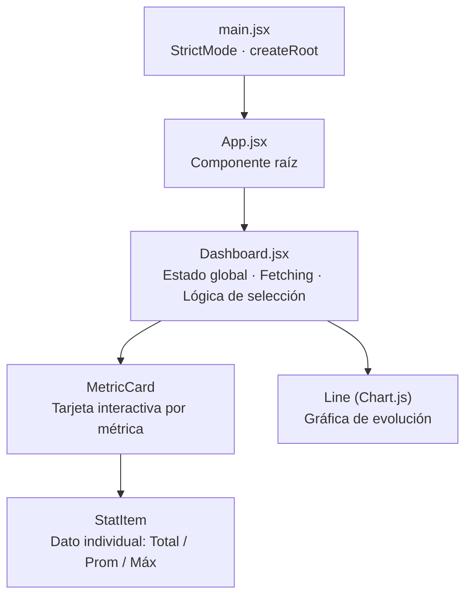
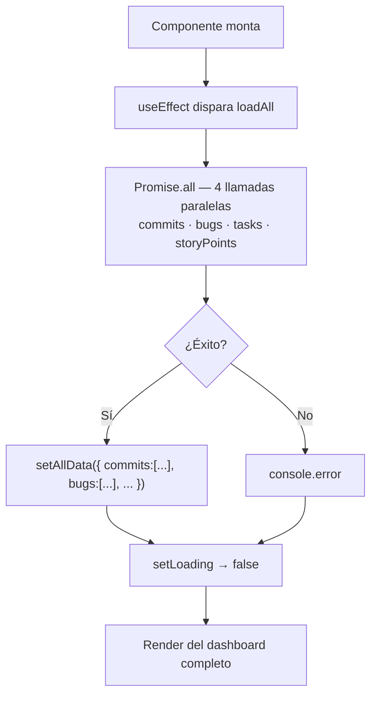
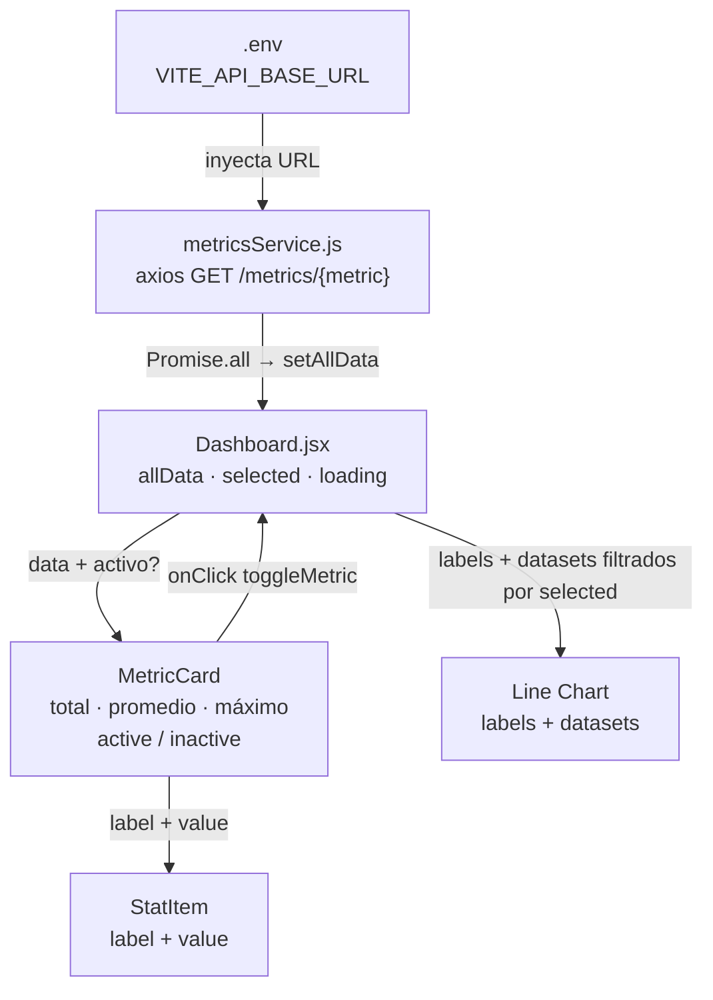

# M6 AdvanceWeb ActividadClase AnalisisCodigoFrancisco

Aplicación web para visualizar métricas de productividad de desarrolladores.  
El backend expone una API REST con Spring Boot; el frontend las consume y grafica con React + Chart.js.

---

## Cómo correr el proyecto

**Backend**
```bash
cd backend
./mvnw spring-boot:run
# Servidor en http://localhost:8080
```

**Frontend**
```bash
cd frontend/productivity-dashboard
cp .env.example .env   # solo la primera vez
cd ..
npm install
npm run dev
# App en http://localhost:5173
```

---

---

# Parte 1 — Análisis del Backend

## 1. Estructura general del proyecto

```
backend/
├── pom.xml
└── src/
    ├── main/
    │   ├── java/com/exampleback/demo/
    │   │   ├── DemoApplication.java          ← Punto de entrada
    │   │   ├── config/
    │   │   │   ├── CorsConfig.java           ← Configuración de CORS
    │   │   │   ├── MetricsProperties.java    ← Binding de datos del YAML
    │   │   │   └── SecurityConfig.java       ← Configuración de seguridad
    │   │   ├── controller/
    │   │   │   └── MetricsController.java    ← Capa HTTP
    │   │   ├── dto/
    │   │   │   └── MetricResponseDTO.java    ← Forma del JSON de respuesta
    │   │   ├── model/
    │   │   │   └── DeveloperMetric.java      ← Modelo de datos interno
    │   │   ├── repository/
    │   │   │   └── DeveloperMetricRepository.java ← Acceso a datos
    │   │   └── service/
    │   │       └── MetricsService.java       ← Lógica de negocio
    │   └── resources/
    │       └── application.yml              ← Configuración y datos
    └── test/
        └── java/com/exampleback/demo/
            └── DemoApplicationTests.java
```

**Stack:** Java 21 · Spring Boot 4 · Spring Security · Lombok

---

## 2. Función de las capas

### Controller — `MetricsController`

Recibe las peticiones HTTP y las delega al servicio. No contiene lógica de negocio.

```java
@GetMapping("/{metric}")
public List<MetricResponseDTO> getMetricData(@PathVariable String metric) {
    return service.getMetricData(metric);
}
```

| Responsabilidad | Detalle |
|---|---|
| Mapeo de ruta | `GET /metrics/{metric}` |
| Extracción de parámetro | `@PathVariable String metric` |
| Respuesta | Serializa automáticamente el `List<MetricResponseDTO>` a JSON |

---

### Service — `MetricsService`

Contiene la lógica de negocio: valida el parámetro, selecciona el getter correcto y transforma los datos del modelo al DTO.

```java
Function<DeveloperMetric, Integer> getValue = switch (metric) {
    case "commits"     -> DeveloperMetric::getCommits;
    case "bugs"        -> DeveloperMetric::getBugsFixed;
    case "tasks"       -> DeveloperMetric::getTasksCompleted;
    case "storyPoints" -> DeveloperMetric::getStoryPoints;
    default -> throw new ResponseStatusException(HttpStatus.BAD_REQUEST, "Unknown metric: " + metric);
};
```

| Responsabilidad | Detalle |
|---|---|
| Validación | Lanza `400 Bad Request` si el métrico no existe |
| Transformación | Convierte `DeveloperMetric` → `MetricResponseDTO` |
| Eficiencia | El switch se resuelve **una sola vez** antes del stream |

---

### Repository — `DeveloperMetricRepository`

Abstrae el origen de los datos. Actualmente los lee desde `MetricsProperties` (YAML), lo que permite sustituirlo por una base de datos real sin tocar el servicio.

```java
public List<DeveloperMetric> findAll() {
    return metricsProperties.getMetrics();
}
```

---

### DTO — `MetricResponseDTO`

Define exactamente qué campos recibe el cliente. Al ser un `record` de Java 21 es inmutable por diseño.

```java
public record MetricResponseDTO(String label, Integer value) {}
```

| Campo | Tipo | Ejemplo |
|---|---|---|
| `label` | String | `"2026-05-01"` |
| `value` | Integer | `12` |

---

### Model — `DeveloperMetric`

Representa internamente las métricas de un desarrollador para un día. **No se expone directamente** al cliente; el servicio lo transforma al DTO.

| Campo | Tipo | Descripción |
|---|---|---|
| `developerName` | String | Nombre del desarrollador |
| `metricDate` | LocalDate | Fecha de la métrica |
| `commits` | Integer | Número de commits |
| `bugsFixed` | Integer | Bugs resueltos |
| `tasksCompleted` | Integer | Tareas completadas |
| `storyPoints` | Integer | Story points entregados |

---

### Config — `MetricsProperties`

Lee la lista `app.metrics` de `application.yml` mediante `@ConfigurationProperties`. Hace que los datos sean configurables sin recompilar el proyecto.

```yaml
app:
  metrics:
    - developer-name: Francisco
      metric-date: 2026-05-01
      commits: 12
      bugs-fixed: 2
```

---

## 3. Flujo de una petición





---

## 4. Configuración de seguridad y CORS

### `SecurityConfig`

| Configuración | Valor | Motivo |
|---|---|---|
| CSRF | Deshabilitado | La API es stateless, no usa sesiones de navegador |
| CORS | Delegado a `CorsConfig` | Centraliza la configuración en un solo lugar |
| Autenticación | `anyRequest().permitAll()` | API pública, sin login |

### `CorsConfig`

| Propiedad | Valor | Origen |
|---|---|---|
| `allowedOrigins` | `http://localhost:5173` | `application.yml → cors.allowed-origins` |
| `allowedMethods` | GET, POST, PUT, DELETE, OPTIONS | Hardcodeado en config |
| `allowedHeaders` | `*` | Cualquier header |
| `allowCredentials` | `true` | Permite cookies/auth headers |

El origen **no está hardcodeado** en Java: se lee desde `application.yml`, lo que permite cambiarlo para producción sin recompilar.

---

## 5. Posibles mejoras del Backend

| Área | Mejora |
|---|---|
| Datos | Conectar una base de datos real (PostgreSQL) y usar Spring Data JPA |
| Validación | Agregar `@Pattern` al `@PathVariable` para rechazar valores inválidos antes del service |
| Documentación | Integrar Springdoc OpenAPI para exponer `/swagger-ui` automáticamente |
| Pruebas | Agregar pruebas unitarias de `MetricsService` con JUnit 5 + Mockito |
| Filtrado | Permitir filtrar por rango de fechas o nombre de desarrollador como query params |
| Múltiples desarrolladores | Agregar más entradas en `application.yml` o conectar a BD |

---

---

# Parte 2 — Análisis del Frontend

## 1. Estructura de carpetas

```
frontend/
├── package.json                          ← Workspace raíz (scripts npm)
└── productivity-dashboard/
    ├── .env                              ← Variables de entorno (URL del backend)
    ├── index.html                        ← HTML base de la SPA
    ├── vite.config.js                    ← Configuración de Vite
    ├── package.json                      ← Dependencias del proyecto
    └── src/
        ├── main.jsx                      ← Punto de entrada React
        ├── App.jsx                       ← Componente raíz
        ├── index.css                     ← Estilos globales + variables CSS
        ├── component/
        │   └── Dashboard.jsx             ← Componente principal + subcomponentes
        ├── services/
        │   └── metricsService.js         ← Capa de acceso a la API
        └── styles/
            └── Dashboard.module.css      ← Estilos con CSS Modules
```

**Stack:** React 19 · Vite 8 · Chart.js 4 · react-chartjs-2 · axios

---

## 2. Componentes principales



### `App.jsx`
Componente raíz mínimo — solo renderiza `<Dashboard />`. Mantiene limpio el punto de entrada.

### `Dashboard.jsx`
Componente principal. Concentra estado, fetching y toda la UI. Internamente define dos subcomponentes:

- **`MetricCard`** — botón-tarjeta que muestra el nombre de la métrica, su color identificador y las estadísticas calculadas (total, promedio, máximo). Actúa como toggle de visibilidad en la gráfica.
- **`StatItem`** — celda pequeña con una etiqueta y un valor numérico. Presentacional puro, sin estado.

---

## 3. Manejo del estado con Hooks

| Hook | Estado | Tipo | Propósito |
|---|---|---|---|
| `useState` | `allData` | `{}` → `{ commits: [...], bugs: [...], ... }` | Almacena los arrays de datos de cada métrica |
| `useState` | `selected` | `string[]` | Controla qué métricas se muestran en la gráfica |
| `useState` | `loading` | `boolean` | Muestra/oculta el indicador de carga |
| `useEffect` | — | — | Dispara el fetch de las 4 métricas al montar |

### Flujo del `useEffect`



### Lógica de selección (`toggleMetric`)

```js
setSelected(prev =>
  prev.includes(key)
    ? prev.length > 1 ? prev.filter(k => k !== key) : prev  // mínimo 1 activa
    : [...prev, key]
);
```

Garantiza que siempre haya al menos una métrica seleccionada para que la gráfica nunca quede vacía.

---

## 4. Consumo de APIs

### `metricsService.js`

```js
const API_URL = `${import.meta.env.VITE_API_BASE_URL}/metrics`;

export const getMetricData = async (metric) => {
  const response = await axios.get(`${API_URL}/${metric}`);
  return response.data;
};
```

| Aspecto | Detalle |
|---|---|
| URL base | Leída de `.env` → `VITE_API_BASE_URL=http://localhost:8080` |
| Método HTTP | `GET /metrics/{metric}` |
| Librería | axios |
| Estrategia | Las 4 métricas se obtienen en paralelo con `Promise.all` |

### Valores válidos de `{metric}`

| Key (frontend) | Endpoint (backend) | Campo del modelo |
|---|---|---|
| `commits` | `/metrics/commits` | `getCommits()` |
| `bugs` | `/metrics/bugs` | `getBugsFixed()` |
| `tasks` | `/metrics/tasks` | `getTasksCompleted()` |
| `storyPoints` | `/metrics/storyPoints` | `getStoryPoints()` |

---

## 5. Flujo de datos entre componentes



La interacción es bidireccional entre `Dashboard` y `MetricCard`: el dashboard pasa los datos hacia abajo y la tarjeta notifica hacia arriba cuando el usuario la clickea.

---

## 6. Implementación de gráficas

### Configuración de Chart.js

```js
ChartJS.register(
  CategoryScale, LinearScale,
  PointElement, LineElement,
  Title, Tooltip, Legend
);
```

Solo se registran los módulos necesarios, reduciendo el bundle final.

### Estructura del dataset

Cada métrica seleccionada se convierte en un dataset independiente:

```js
{
  label: metric.label,           // "Commits", "Bugs Fixed", etc.
  data: data.map(i => i.value),  // valores numéricos
  borderColor: metric.line,      // color de línea único por métrica
  backgroundColor: metric.fill,  // relleno semitransparente
  fill: selected.length === 1,   // relleno solo si hay una métrica activa
  tension: 0.4,                  // curva suavizada
}
```

### Opciones del gráfico

| Opción | Valor | Efecto |
|---|---|---|
| `interaction.mode` | `"index"` | El tooltip muestra todos los datasets en el mismo punto X |
| `scales.y.beginAtZero` | `true` | El eje Y siempre parte de cero |
| `scales.x.grid.display` | `false` | Quita las líneas verticales de la cuadrícula |
| `responsive` | `true` | Se adapta al tamaño del contenedor |

### Colores por métrica

| Métrica | Línea | Relleno |
|---|---|---|
| Commits | `#6ea8fe` (azul) | `rgba(110,168,254,0.15)` |
| Bugs Fixed | `#f4a4a4` (rojo suave) | `rgba(244,164,164,0.15)` |
| Tasks | `#6fcf97` (verde) | `rgba(111,207,151,0.15)` |
| Story Points | `#bb8eed` (morado) | `rgba(187,142,237,0.15)` |

---

## 7. Posibles mejoras del Frontend

| Área | Mejora |
|---|---|
| Errores | Mostrar un mensaje de error en pantalla si falla el fetch (actualmente solo `console.error`) |
| UX de carga | Skeleton loader en lugar del texto "Cargando datos..." |
| Filtros | Selector de rango de fechas para ver un periodo específico |
| Multi-desarrollador | Dropdown para cambiar de desarrollador cuando el backend soporte más de uno |
| Accesibilidad | Agregar `aria-label` a los botones de `MetricCard` |
| Pruebas | Tests con Vitest + React Testing Library para `Dashboard` y `MetricCard` |
| Variables de entorno | Crear `.env.production` con la URL del backend en producción |
